**Advanced Lane Finding Project**

All the python code are within the Ipython file Advanced_Lane_Finding.ipynb

I may have saved the file in html format for easier review of the content and video.

The goals / steps of this project are the following:

* Compute the camera calibration matrix and distortion coefficients given a set of chessboard images.
* Apply a distortion correction to raw images.
* Use color transforms, gradients, etc., to create a thresholded binary image.
* Apply a perspective transform to rectify binary image ("birds-eye view").
* Detect lane pixels and fit to find the lane boundary.
* Determine the curvature of the lane and vehicle position with respect to center.
* Warp the detected lane boundaries back onto the original image.
* Output visual display of the lane boundaries and numerical estimation of lane curvature and vehicle position.

## [Rubric](https://review.udacity.com/#!/rubrics/571/view) Points

### Here I will consider the rubric points individually and describe how I addressed each point in my implementation.  

---

### Writeup / README

#### 1. Provide a Writeup / README that includes all the rubric points and how you addressed each one.  You can submit your writeup as markdown or pdf.  [Here](https://github.com/udacity/CarND-Advanced-Lane-Lines/blob/master/writeup_template.md) is a template writeup for this project you can use as a guide and a starting point.  

You're reading it!

### Camera Calibration

#### 1. Briefly state how you computed the camera matrix and distortion coefficients. Provide an example of a distortion corrected calibration image.

The related code is in the **Camera Calibration** section of the IPython notebook

The following tasks are performed
- Perform camera calibration on provided calibration images.
- Create a utility function undistortImage using the resultant correction matrix.
- Verify the performance of the function with test image(s).

I start by preparing "object points", which will be the (x, y, z) coordinates of the chessboard corners in the world. Here I am assuming the chessboard is fixed on the (x, y) plane at z=0, such that the object points are the same for each calibration image.  Thus, `objp` is just a replicated array of coordinates, and `objpoints` will be appended with a copy of it every time I successfully detect all chessboard corners in a test image.  `imgpoints` will be appended with the (x, y) pixel position of each of the corners in the image plane with each successful chessboard detection. 

Configure the number of inside corner of the chessboard to be 9 columns and 6 rows. Use `cv2.findChessboardCorners` to obtain the coordinates of the corners for each calibration images. Notice that the algorithm failed to detect corners in 3 of the total 20 calibration images because several corners are chopped at the edge of the image. Great! We can use these images to verify the result of calibration, since it won't be used by the calibration step.

I then used the output `objpoints` and `imgpoints` to compute the camera calibration and distortion coefficients using the `cv2.calibrateCamera()` function, which gives me the calibration matrices `mtx` and `dist`.

For easier use, I created a utility function `undistortImage` which basically applies `cv2.undistort` with the calculated undistortion matrices `mtx` and `dist` to any input image.

Finally I test the result by calling `undistortImage` with image calibration1.jpg and here is the before vs after:

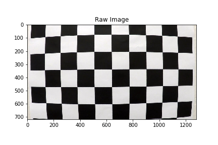
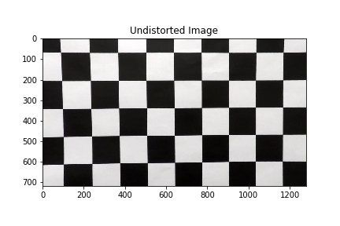

### Pipeline (single images)

#### 1. Provide an example of a distortion-corrected image.

During the camera calibration verification, the function `undistortImage` is further verified on a road image test4.jpg. Result shown as below.

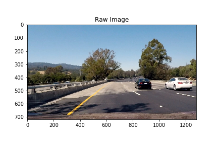


#### 2. Describe how (and identify where in your code) you used color transforms, gradients or other methods to create a thresholded binary image.  Provide an example of a binary image result.

The related code is in the **Color / Gradient Filter** section of the notebook.

I created a function `applyThreshold` that takes a color image as input, applies a combination of color and gradient thresholds to output a binary image.

Here's an example of my output for this step.  

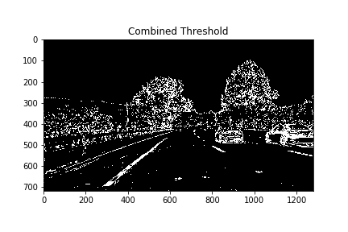

#### 3. Describe how (and identify where in your code) you performed a perspective transform and provide an example of a transformed image.

The related code is in the **Perspective Transform** section of the notebook.
In this section, the following tasks are performed
- Use one straight line image (straight_lines1.jpg) as reference to prepar perspective transform matrices.
- Create utility funtion warpImage with the resultant transformation matrices.
- Create utility funtion unwarpImage with the resultant transformation matrices.
- Use second straight line image (straight_lines2.jpg) to verify.

First I pick 2 points (after several attemps) on the left lane line on the reference image. Then with the assumption that the vehicle is centered in the lane, I mirror the x coordinates cross the center of the image to get 2 points (hopefully) landing on the right lane line. The 4 source points can be seen in the below image.
```python
# Identify 2 points on the left lane line
left_top = [590,450]
left_bot = [300,650]
# Mirror the points to the right lane line with the assumption the image is taken with vehicle centered in the lane
right_top = [(img_st1.shape[1] - left_top[0]),left_top[1]]
right_bot = [(img_st1.shape[1] - left_bot[0]),left_bot[1]]
src = np.float32([left_top,left_bot,right_bot,right_top])
```

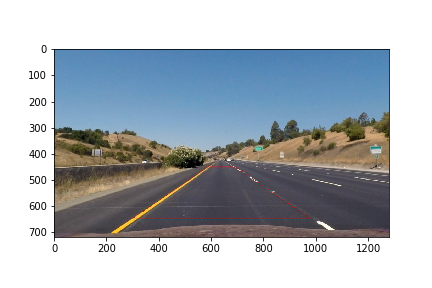

Then again, knowing the 4 source points are taken on a straightline, we expect their destination points on the bird-eye view to form a rectangle. So we have the `dst` points as below.
```python
dst = np.float32(
    [[300,100],
     left_bot,
     right_bot,
     [right_bot[0],100]])
```
Next I call `cv2.getPerspectiveTransform` to obtain the warp matrix as well as the inverse warp matrix `M` and `Minv` given the `src` and `dst` points.

With the two matrices, I created two utilty functions `warpImage` and `unwarpImage` for easier use. The function simply performs propective transform using cv2.warpPerspective with the resultant `M` or `Minv` matrices.

The test image tranformed into below image.

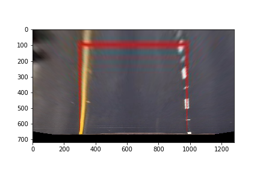

By calling `warpImage` with the verification image and then `unwarpImage` on the resultant image, we obtained below result and verified that both the warping and unwarping function work as expected. 

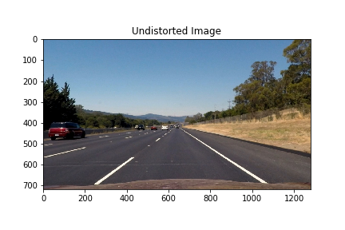
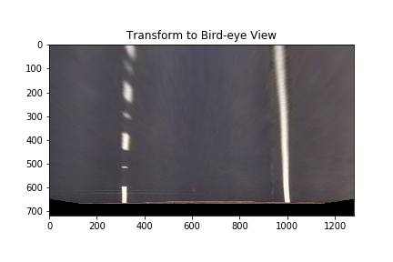
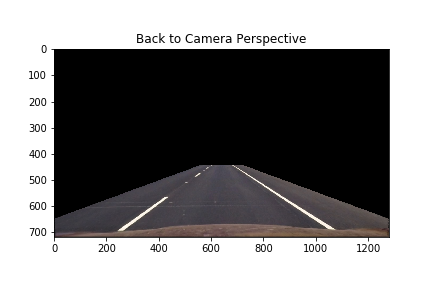

#### 4. Describe how (and identify where in your code) you identified lane-line pixels and fit their positions with a polynomial?

The **The Pipeline** section of the IPython notebook defined the function `ProcessImage` that takes in a raw color image and does the process of image processing and lane detection and so on.

Before anything else, we've create two `Line` objects to track the left and right lane line marker individually. 

Now into the `ProcessImage` function, first use the utility functions described previously to perform undistortion, thresholding, and perspective transform to the input image.

Next call either `slidingWindow` or `searchNearby` to detect pixels that belong to the lane line depending on whether a previous detection is available.

Once the left and right line object has been updated with a new set of pixels, we call the `fit_poly` method to try to fit the pixels to a polynomial. The `fit_poly` method of `Line` first finds the 2nd order polynomial coefficient of the lastest set of pixels. Then it appends the fitted line to a buffer which contains all the fittings from the previous up to n (i.e. n = 5) detections. Then it calls the `UpdateAverageLine` to fit a new polynomial with all the points from the buffer and store the coefficient in `best_fit`. This 'filtering' effect allows to smooth out the result as well as reduce the impact from a 'bad' frame.

Example of a warped image getting detected pixels and lines.

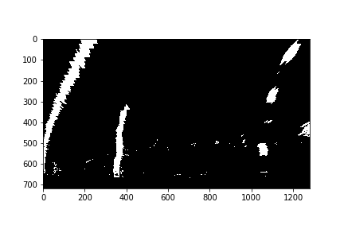
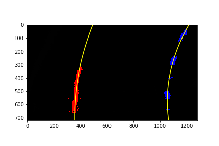

#### 5. Describe how (and identify where in your code) you calculated the radius of curvature of the lane and the position of the vehicle with respect to center.

In the **Pixel to World Conversion** section of the notebook, we land 3 reference points on the bird eye view of the straight line image. The 3 points shows the number of pixels representing the width of the lane and the length of white dash line, which according to the lesson material, are 12 and 10 feet respectively. With that, we obtain the two conversion factors: `meter_per_pixel_x` and `meter_per_pixel_y`.

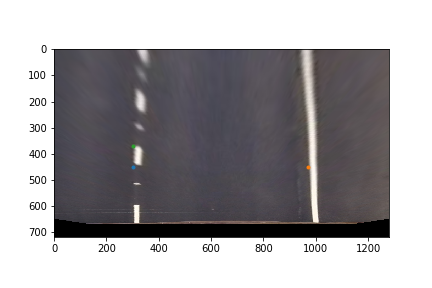

In the `Line` class, `UpdateRadius` method applies the conversion factors to the current line in the pixel world to get x and y in real world with unit meter. Then we fit a new polynomial for the x and y. Lastly the `radius_of_curvature` is calculated at the bottom of the image where the vehicle is.

In the `Line` class, `UpdateOffset` method applies the conversion factor, this time only in x coordinate needed, to get the offset of the line from the center of the image and store in `line_base_pos`. At the end of the pipeline function, we simply take the averageof the left and right line position, to get the overall offset of the vehicle from the middle of the lane.
```python
offset = (LeftLine.line_base_pos + RightLine.line_base_pos) /2
```

#### 6. Provide an example image of your result plotted back down onto the road such that the lane area is identified clearly.

At the end of `ProcessImage`, we project the plotting points `plotx` and `ploty` from both left and right line and fill the area.
A list of information is also projected onto the image.

Example the the final image as below.

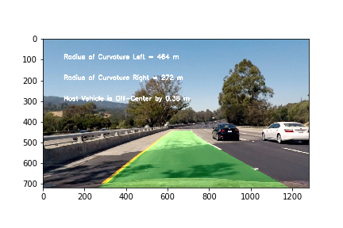

---

### Pipeline (video)

#### 1. Provide a link to your final video output.  Your pipeline should perform reasonably well on the entire project video (wobbly lines are ok but no catastrophic failures that would cause the car to drive off the road!).

Here's a [link to my video result](./project_video_output.mp4)

---

### Discussion

#### 1. Briefly discuss any problems / issues you faced in your implementation of this project.  Where will your pipeline likely fail?  What could you do to make it more robust?

During the project, I came to realize that it is unrealistic to debug every problematic frame and try to tune the algorithm to be able to detect lane line in all of them. Shade has created a lot of trouble. The edge of the concret road barrier forms a distracting line in parallel to the lane lines, etc.

The 'filtering' of n previous detection definetly helped in reducing the severity of a bad detection from a difficult frame.

Here's some thoughts on improvement possible as far as lane line detection is concerned:
* implement a 'confidence' calculator to assign a weight to each detection such that a more confident detection updates the final result faster while a lower confidence detection relies more on previous detection
* A lower confidence detection peeks at the other line to 'borrow' pixels or gain extra information.

I'm not satisfied about the way radius of curvature is calculated. In my code, I am simply calculating the value at the bottom of the image with the 2nd order polynomial fit coefficient. I think numerical result is highly susceptible to any minor error of the polynomial fit. In order to achieve a better idea of the future heading of the road, we should consider the rough curvature in the next few seconds, instead of focusing on the pixel level. I would try fit a circle (arc) to the bottom half of the lane lines and obtain the radius of the circle as the better answer now that I am thinking about it again. 
